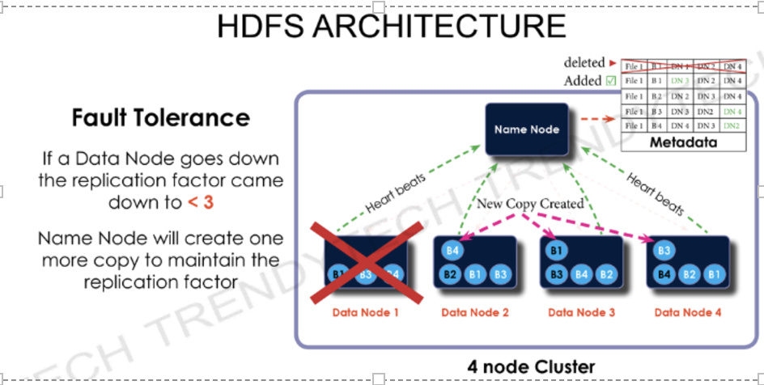

# 4 Vs of Bigdata: 
============================= 

* Volume  - 2.5 quintillion data Created everyday  

* Variety  - Structured/ Unstructured/Semi-structured  

* Velocity -  
    900 Million photos on Facebook 

    600 Million tweets on Twitter 

    0.5 Million hours of video on YouTube 

    3.5 Billion searches on Google 

* Veracity – Poor Quality and unclean data 

 

# Name Node and Data Node: 
* Name Node :  
    Store the metadata for the data node to block mapping. 

* Data Node :  
    Stores the file block data. 

* Default Block Size : 128 MB 

# Data Node Failure : 
============================= 
Default Hadoop Replication Factor : 3  . But replication factor can be altered as per requirement.   

* Heartbeat : 
Each data node sends heartbeat to name node every 3 seconds. If Name node does not receive 10 consecutive heartbeat then it considers that data node is dead/ running slow.  

Name Node Failure: 

============================= 

 

Problem – We will lose the block mapping information/metadata. What we want is the latest block mapping information, that we can make sure there is no downtime. 

 

Hadoop Version 1 , Name node was  a single point of failure. 

Hadoop Version 2 , Name node is not a single point of failure.  

 

 

2 important metadata Files: 

============================ 

 

FS image 

 snapshot of in memory file system at a given moment 

Edit logs (edits)  

all new transactions that happened after the snapshot is taken will come to the edit log file. 

 

Merging of FS image + edit logs will give you the latest FS image.  

This Merging is a compute heavy process so Name node should not take this activity of merging as Name node is already busy.  

 

 

Secondary Name Node : (Passive) 

============================= 

Merging of the two files will be taken up by the Secondary Name Node.  

Then it becomes the primary name node and Hadoop admin creates the secondary name node. 

 

HDFS ARCHITECTURE 
Checkpointing 
Secondary NameNode 
performs FSimage and Edit 
logs merging to get new 
updated FSimage 
This process repeats after 
every 30 seconds 
Evgy Seconds 
Edit 
Merge Act 
New FSmage 
 

 

What will happen if the block size decreases  

 

In this case more number of files will be created as a result there will be overhead on the Name node for maintaining the metadata.  

 

What will happen if the block size increases 

 

Less Number of files will be created and as a result the cluster can be fully utilized. And we cannot make use of parallelism.  

 

 

Rack Awareness : 

 

Rack is group of systems placed in different geographical locations. 

 

Configuration Files: 

 

cd /etc/hadoop/conf  

 

 hdfs-site.xml 

 mapred-site.xml 

 core-site.xml 

 yarn-site.xml 